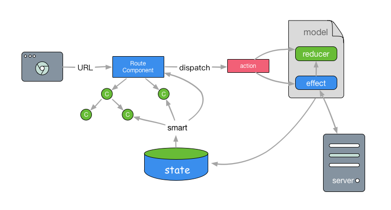

# model

所谓 model，是一个整合了 redux 的 state、action、reducer（含同步、异步）、dispatch、contant 管理功能的集合体，开发者不要为了修改一个小功能频繁的在多个文件甚至目录之间切换，带来体力和脑力的开销。

model 由 <a href="https://github.com/gem-mine/cat-eye" target="_blank">cat-eye</a> 提供，model 层设计重度参考了 <a href="https://github.com/mirrorjs/mirror" target="_blank">mirror</a>，如果你熟悉 mirror，那么你会觉得这里的设计格外亲切。遇到下面一些概念的迷惑（actions、reducers、effects），亦可以参考 mirror 的文档 <a href="https://github.com/mirrorjs/mirror/blob/master/docs/zh/api.md" target="_blank">mirror API</a>



## 定义 model

model **有且仅有 4 个属性值，分别是：name，state，reducers，effects**，我们通常这样定义一个 model：

```javascript
import ce from 'cat-eye'

ce.model({
  name: 'user',
  state: {},
  reducers: {},
  effects: {}
})
```

* name 的作用
  name 是 model 的名称，用于创建命名空间，该命名空间起到了两个作用（后续会看到如何使用）：
  * 将模块自己的 state 挂载到此命名空间下
  * 将模块自己的 actions 挂载到此命名空间下
* state：**model 的初始 state**，这是 redux reducer 中标准的 initialState
* reducers：reducers 由一个个 function 组成，包含了 3 个方面的能力：
  * 用于创建 redux 中的 reducer
  * 自动根据[model name + reducer name] 来创建 action，因此一个 reducer 对应的是一个 action
  * 将 action 挂载在 actions[model] 下，通过 reducer name 来访问

> 注意，reducer 必须返回一个 state，这是 redux reducer 要求的

```javascript
// src/global/model/user.js
import ce from 'cat-eye'
ce.model({
  name: 'user',
  state: {
    age: 18,
    nickname: 'jerry'
  },
  reducers: {
    growUp() {
      return this.setField({
        age: v => v + 1
      })
    }
  }
})

// 在你需要的地方，通常是在 jsx 或者 model 的 effects 中调用
// 例如 某个 jsx 中
import { actions } from 'cat-eye'

export default props => {
  return <button onClick={actions.user.growUp}>click me</button>
}
```

上面代码中，注意到 growUp 这个 reducer 中，使用了 this.setField，这是一个强大易用高效的工具，内部结合了 轻量的 immutable 功能，先不要着急如何使用，本文后面会为你介绍。

* effects：一般异步的操作（有副作用的操作，非纯函数）放在 effects，而不放在 reducers 中。对于业务来说，大部分操作都是异步请求，因此 effects 更经常使用。另外，effects 无须返回 state，通常我们会把异步操作返回，也就是返回一个 promise。除此之外，effects 看起来和 reducers 并没有什么两样，定义的方法同样会挂载到 actions 上。

reducers、effects 更详细的用法后面也会介绍。

## 使用 model

### model 的加载

model 是自动引入到系统的，但需要满足下面其中一个原则：

* 全局的 model 放在 `src/global/model` 目录下，命名可以自定义，例如放 user.js 这种各个模块都可能使用到的公用 model
* 业务的 model 放在业务自己的目录下，必须取名为 `model.js`

### actions 的使用

在 model 中定义好 reducers、effects 后，这些方法就会挂载在 actions 下，可以直接拿来使用：

```javascript
import { actions } from 'cat-eye'
```

如果不需要进行加工，可以在 JSX 中直接调用对应的方法：

```
<SomeComponent onClick={actions.user.growUp} />
```

需要进行一些数据操作，可以在组件的方法中定义：

```
import React, {Component} from 'react'
import {actions} from 'cat-eye'

class SomeComponent extends Component {
  handleClick = () => {
    // some code ...
    actions.user.growUp()
    // some code ...
  }
  render() {
    return (
      <button onClick={this.handleClick}>click me</button>
    )
  }
}
```

注：actions 中默认存在一个 routing 对象，用于浏览器地址的操作（跳转、前进、后退等），详细请参看 <a href="#/docs/api/router">js 中的路由跳转</a>

### 组件中使用 model：smart、actions

组件中使用 model 通过 cat-eye 提供的 smart，这个是 react-redux connect 易用版：

```javascript
import { smart } from 'cat-eye'

export default smart(mapStateToProps, mapDispathToProps)(SomeComponent)
```

这样看起来和 connect 似乎并无差别，重点是 mapDispatchToProps 可以直接取到 this.props 的值作为参数，来看下 mapDispatchToProps 的使用：

```javascript
import { actions } from 'cat-eye'
// mapDispatchToProps 的 props 即这个组件的 this.props
export default smart(null, props => {
  // 一般 mapDispatchToProps 会调用 actions 提供的方法，以此来更新 state
  const act = actions.user
  return {
    growUp: act.growUp
  }
})(SomeComponent)
```

而 mapStateToProps 和 connect 并无两异：

```
// mapStateToProps
(state, ownProps) => {
  const s = state.user;
  return {
    // the fields you want to map
  }
}
```

cat-eye 同样将 connect 暴露了出来，但推荐你使用 smart。

### setField

setFiled 依赖于 <a href="https://github.com/gem-mine/zero-immutable" target="_blank">zero-immutable</a> 的实现，将 immutable 的能力内置在 gem-mine 中，既提高了性能，也很大程度降低了代码的繁琐。

#### setField 接受的参数

setField(object)：接受一个 key-value 的对象作为参数：

```javascript
{
  name: 'tom',
  age: 20
}
```

setField 接受的 key-value 不支持多级，对于 state 是多层级的情况，可以这样处理：

```javascript
// state
{
  name: 'tom',
  family: [{
    name: 'lily'
  }, {
    name: 'jerry'
  }],
  job: {
    title: 'manager'
  }
}

// setField 参数
{
  'family.1.name': 'pig', // 将 jerry 修改
  'job.title': 'boss'
}
```

key-value 的 value 还可以是一个 function：

```
{
  age: age => age + 1
}
```

#### actions 内置 setField

所有的 model，其 reducers 都会默认注册一个 setField 方法，这样 actions 上就会有该 model 的 setField 方法。正是由于这个方法的存在，导致了 reducers 存在感非常低，大部分设值操作都变得多余，直接通过 setField 进行即可。

```javascript
import { actions } from 'cat-eye'

// 在某个组件中直接修改 user state，无须定义 reducer
actions.user.setField({
  name: 'tom',
  age: age => age + 1
})
```

如果是纯粹的 redux 开发，这里要定义常量，定义 state，定义 action，实现 reducer，最后才在组件中进行 dispatch（可能还需要 connect），这里就简化成了一步。

#### 在 reducers 中使用

**重要：reducers 中定义的 function 请不要使用箭头函数，否则会丢失 this**

reducers 的 function 是这样定义的：

```javascript
// user model 的 reducers

{
  // data 是 actions.user.growUp(data) 传入的
  // getState 可以获取到 redux 的整个 state
  growUp(data, getState) {
    // reducer 必须 return 一个新的 state，setField 就有这个能力
    return this.setField({
      // ...
    })
  }
}
```

可以看到，reducer 中的 this 具有 setField 方法，可以对自己的 model 的 state 进行更新。对于获取 state 的，分为：

* 获取自己 model 的 state：通过 `this.getState()` 就可以拿到
* 获取所有的 state：通过第二个参数 `getState()` 可以拿到，然后根据命名空间来获取，例如 getState().book.name

#### 在 effects 中使用

effects 中的使用和 reducers 中完全一样，只是无须返回 state。同样，**请不要使用箭头函数**。一般在 effects 中会使用到 网络请求，这部分文档参看
<a href="#/docs/api/request">网络请求</a>

```javascript
// user model 的 effects
import {request} from 'cat-eye'
const {api} = request

{
  // data 是 actions.user.fetchSomething(data) 传入的
  // getState 可以获取到 redux 的整个 state
  fetchSomething(data, getState) {
    api.post({}).then(data => {
      this.setField({
        // ...
      })
    })
  }
}
```

获取 state（自己或者全局）和 reducers 是一致的，分别是通过 this.getState() 和 函数的第二个参数 getState() 来获得。
