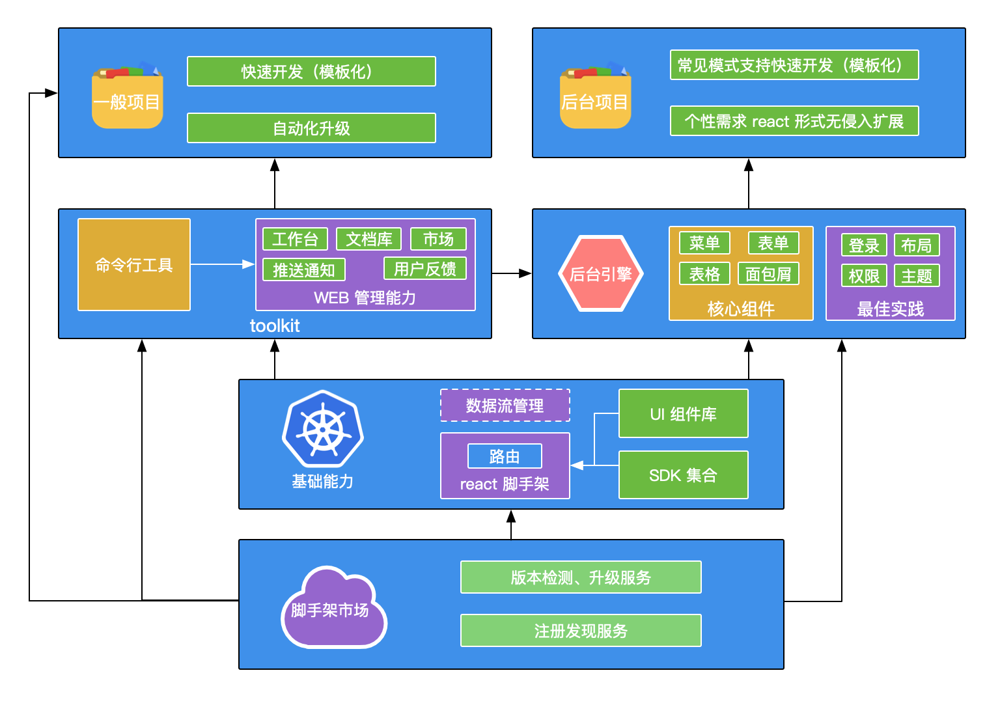

# gem-mine 是什么

**gem-mine 宝石矿产**，一个蕴藏许多珍宝的脚手架。

gem-mine 是一个快速创建基于 react + redux + router 的脚手架工具，同时提供代码框架进行业务快速开发。

## 特性

* 基于命令行快速创建项目骨架

  * 支持选择平台类型：PC 端、移动端
  * 支持选择是否对 IE8 进行支持，默认支持。**这里的兼容不仅仅是 polyfill，对于 react、webpack 等版本都会进行处理**
  * 支持选择内置 UI 组件库
  * 支持快速生成管理后台结构

* 基于 cat-eye 猫眼，提供了一套优质的代码框架与工具

  * 简洁易用的 model 系统，大大降低 redux 的繁琐与复杂度
  * 抽象封装的 router 系统，基于 react-router 4，支持子路由、权限控制与继承
  * 轻量高效的 immutable 工具，简化对 state 的操作，同时提高性能
  * 强大简单的网络请求 request 工具，基于 axios
    * 支持多种方式处理跨域问题（server 代理、nginx 反向代理、CORS 跨域）
    * 支持多站点跨域
    * 可以根据不同环境变量进行统一配置

* 国际化方案（暂未支持）
  * 业务国际化
  * UI 组件库国际化
  * 工具类国际化（moment 定制）
  * 支持远程翻译资源文件

## 与社区脚手架的差异

<a href="https://github.com/facebookincubator/create-react-app" target="_blank">create-react-app</a> 是 facebook 官方的脚手架，具有简单、易上手、易调试的特点，通过底层提供的 react-scripts 屏蔽了 webpack 配置的复杂度，对于纯粹学习使用 react 来说是一个很好的选择。但如果需要进行一些自定义，则需要进行 eject，create-react-app 会将 webpack 配置重新暴露出来。同时，create-react-app 提供的功能都比较基础纯粹，并不提供 redux、router 等工具的结合使用，也没有整合 less、sass、css 模块化，需要开发者自己进行处理。

<a href="https://github.com/dvajs/dva" target="_blank">dva</a> 是阿里提供的一个脚手架。通过 <a href="https://github.com/sorrycc/roadhog" target="_blank">roadhog</a> 提供了可配置性 create-react-app 开发体验。dva 提供了对 redux 的封装，享受 redux 带来管理数据的便利性的同时降低了使用的繁琐。同时集成了 redux-saga、react-router-redux、react-router，很大程度上给开发带来了便利。

gem-mine 吸收了社区中优质脚手架的优点，同时做了部分增强和改进工作，例如：

* model 层设计吸收了更简洁的 <a href="https://github.com/mirrorjs/mirror" target="_blank">mirror</a> 设计，并内置加入了一个轻量的 immutable 工具，提供了类似 react 的 this.setState 简便操作 state 工具 this.setField 来操作 redux 的 state，而没有官方提供的 immutable 带来的语法和使用成本。
* 再有，在 路由 层面做了增强，对 react-router 做了兼容 IE8 的基础上，同时提供了一套配置性的路由管理工具，支持路由的嵌套、继承、权限控制等。
* 以及，网络请求工具的封装、国际化方案的支持、可选的内置 UI 组件库 等等，都是致力于降低开发人员上手的难度，专注于业务开发，提供生产力。

最后，兼容 IE8 是脚手架的一个另类的特性，是的，真的很另类。
